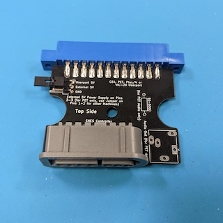
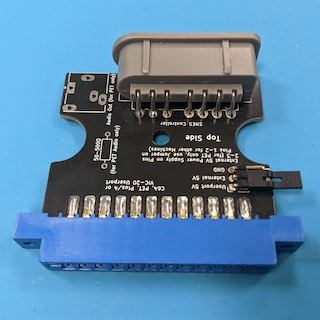
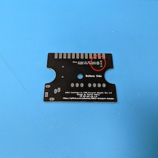
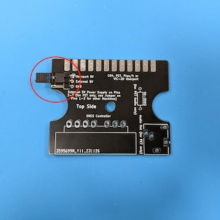
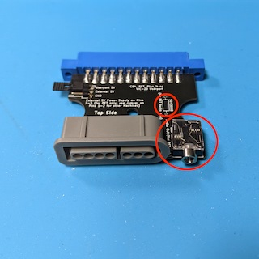
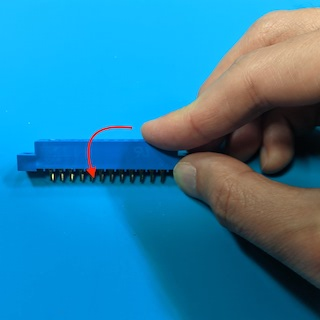
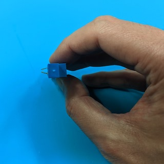
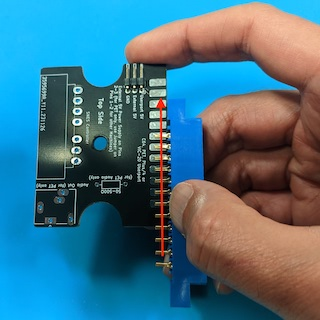
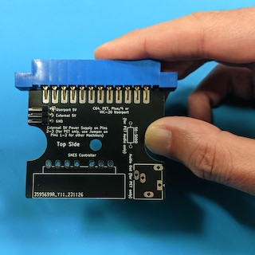
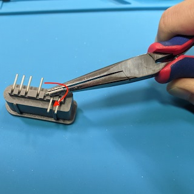

# SNES Controller to CBM Userport Adapter

This repository contains the KiCad project and Gerber files for an adapter that
allows to connect a SNES controller to the Userport of many Commodore 8-bit
computers like the C64, C128, PET, Plus/4 and VIC-20.

This adapter was developed for the game
"[PETSCII Robots](https://www.the8bitguy.com/category/the-8-bit-guy/petscii-robots/)"
by The 8-bit Guy. The official adapter is available for purchase from
[Texelec](https://texelec.com/product/snes-adapter-commodore/). When you live
in North America, I recommend that you buy it there instead of using this
clone. This repository is only for persons living in countries where shipping
from North America and taxes are prohibitively expensive.

The Adapter is also supported by some other games. See the Texelec web site for
more information. You can also use the C64 program
[Joyride](https://github.com/T-Pau/Joyride) to test the adapter.

> [!WARNING]
> This adapter seems to work reliable with original SNES controllers, but there
> are reports that it does not work with third-party controllers! Use at your
> own risk!

## Ordering the PCB

The subdirectory "gerber-files" contains a Zip file you can use to order the PCB
from PCB manufacturers like PCBWay or JLCPCB. Simply upload the Zip on their web
page.

## Building the Adapter

### Bill of Materials

* __1x SNES Controller Socket Right Angle__.

  Search for "90 degree female 7 Pin SNES socket" on AliExpress.

* __1x 24 Pin Edge Connector 3.96mm pitch__.

  Search for "24 Pin Edge Connector 3.96mm" on AliExpress. There are two
  types of connectors, one with pins, and one with soldering lugs. They
  both work, but I recommend the ones with pins.

* (Optional) __1x 3x1 Male Pin Header Through Hole Right Angle 2.54mm pitch__.

  This is only needed when you want to build the external power supply for PETs
  without 5V on the Userport.

* (Optional) __1x Jumper 2.54mm pitch__.

  Also for the external power supply.

* (Optional) __1x 50-500 Ohm Resistor Through Hole 0207 size__.

  This is only needed when using the adapter on an old PET that does not have
  a speaker. In that case, you can fit the adapter with an audio jack for
  sound output.

* (Optional) __1x 3.5mm Audio Jack__ (Ledino KB 3 SPRS or Shenzhen Intech
  PJ-324)

  Also for sound output on old PETs.

### Soldering the Power Supply

The first PET computers do not have +5V on pin 2 of the Userport. For that
reason, the adapter supports a connector for an external power supply.

When you do not plan to use the adapter on such a PET, you can simply close
the jumper on the bottom of the PCB with a blob of solder. This will supply
the SNES controller with +5V from pin 2 of the Userport.

When you want to use the option to use an external power supply, you can solder
the 3x1 male pin header on the top side of the PCB. To use the +5V provided by
pin 2 of the Userport, simply put a jumper on pins 1 and 2 of the pin header.
To use an external power supply, connect +5V to pin 2 and ground to pin 3 by
using female Dupont connectors. You can also use the tape port as an external power
supply, simply connect pin 2 or B of the tape port to pin 2 of the pin header
(no need to connect ground in this case).

### Soldering the Audio Interface

The first PETs did not have any sound output. A popular workaround is to connect
active speakers to pin M of the Userport (search for "PET CB2 sound" on the
Internet). This is also supported by the adapter. Simply solder a resistor
(50-500 Ohms) and an audio jack to the PCB. This of course is not needed on
other Commodore machines and completely optional. It is also currently untested,
so please drop me note when you successfully use this option on a PET.

Unfortunately, getting the audio jack into the PCB is extremly fiddly. Even
though it is an official KiCad footprint, the holes seem to be a little bit to
small.

### Soldering the Userport Edge Connector

Before soldering the Userport connector, you have to bend the pins a little bit
inwards so that they touch the surface of the PCB. Carefully push down the
connector on a hard surface to bend the pins uniformly on both sides.

When you are satisfied with the result, slide the connector onto the PCB. Doing
that can be a little bit fiddly, be careful not to bend any pins sideways!

Solder the edge connector into place. You'll need a lot of solder and heat.

### Soldering the SNES Controller Socket

When you order your SNES controller socket, you'll probably get a socket where
the pins point in the wrong direction. That is not a problem, the pins are only
sticked into the socket and can be rotated into the other direction. By using a
pair of pliers, carefully pull out the pins a little bit, rotate them by 180
degrees, and push them back.

Solder the socket into place. You'll need a lot of heat, especially for the
ground pin (that's the outermost pin on the round side).

## Using the Adapter in your Software

The SNES controller actually just consists of a 16-bit shift register (two
8-bit shift registers on older versions). The 12 buttons are connected to the
parallel inputs of the shift register, and their state gets serially transmitted
to the computer. There are two lines from the computer to the controller called
"Latch" and "Clock", and one line from the controller to the computer called
"Data". When the computer toggles "Latch", the shift register copies the state
of the 12 buttons into its internal register. When the computer toggles "Clock",
the shift register sends the contents of its internal register serially over
"Data" to the computer.

There is a nice [blog post by Michael Steil](https://www.pagetable.com/?p=1365)
that explains this more in detail. He also provides a software example, but
keep in mind that he is using different pins of the Userport, so you have to
adjust his example when using it with this adapter.

The
[source code of PETSCII Robots](https://github.com/zeropolis79/PETSCIIRobots-C64/blob/main/C64ROBOTS.ASM)
is also available on Github. Search for the subroutine called
"SNES_CONTROLER_READ" to see how The 8-bit Guy reads the button states.

Finally, there is the
[source code of Joyride](https://github.com/T-Pau/Joyride/blob/master/src/petscii.s)
available on Github.

## License

SNES Controller to CBM Userport Adapter (c) by Patrick Dähne

SNES Controller to CBM Userport Adapter is licensed under a
Creative Commons Attribution-NonCommercial-ShareAlike 4.0 International License.

You should have received a copy of the license along with this
work. If not, see <https://creativecommons.org/licenses/by-nc-sa/4.0/>.
